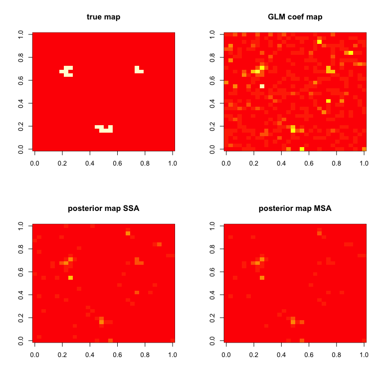

<!-- README.md is generated from README.Rmd. Please edit that file -->


# BHMSMAfMRI: Bayesian Hierarchical Multi-Subject Multiscale Analysis of fMRI Data

<!-- badges: start -->

[](https://CRAN.R-project.org/package=BHMSMAfMRI)
[](https://github.com/nilotpalsanyal/BHMSMAfMRI/actions/workflows/R-CMD-check.yaml)
<!-- badges: end -->

BHMSMAfMRI performs Bayesian hierarchical multi-subject multiscale
analysis of function MRI (fMRI) data as described in Sanyal & Ferreira
([2012](#ref-paper)), or other multiscale data, using wavelet based
prior that borrows strength across subjects and provides posterior
smooth estimates of the effect sizes and samples from their posterior
distribution.

## Installation

### Install from CRAN

``` r
install.packages("BHMSMAfMRI")
```

### Install from GitHub

``` r
# install.packages("devtools")
devtools::install_github("nilotpalsanyal/BHMSMAfMRI", build_vignettes = TRUE)
```

## The main function:

BHMSMA is the main function which accepts fMRI data as a 4D array (see
code below) and a design matrix. For the time-series of all voxels, a
general linear model (GLM) is fit with all the regressors in the design
matrix. After that, the standardized regression coefficient map of a
regressor of interest is subjected to further analysis. The function
BHMSMA returns the posterior smoothed map of the regression
coefficients. Below is a basic illustration of its use. For a detailed
manual, see the package <a
href="https://cran.r-project.org/web/packages/BHMSMAfMRI/vignettes/BHMSMAfMRIvignette.pdf"
target="_blank">vignette</a>.

``` r
library(BHMSMAfMRI)
#> Loading required package: Rcpp

# Read data from image files
fpath <- system.file("extdata", package="BHMSMAfMRI")
untar(paste0(fpath,"/fmridata.tar"), exdir=tempdir())
n <- 3
grid <- 32
ntime <- 9
data <- array(dim=c(n,grid,grid,ntime))
for(subject in 1:n)
{
  directory <- paste0(tempdir(),"/fmridata","/s0",subject,"/")
  a <- readfmridata(directory, format="Analyze", prefix=paste0("s0",subject,"_t"),
                    nimages=9, dim.image=c(grid,grid,1))
  data[subject,,,] <- a[,,1,]
}
data(fmridata)
names(fmridata)
#> [1] "grid"         "nsubject"     "TrueCoeff"    "DesignMatrix"
truecoef <- fmridata$TrueCoeff
designmat <- fmridata$DesignMatrix

# Perform analyses
k <- 2  #consider the second regressor
analysis <- "multi"     #perform multi-subject analysis (MSA)
BHMSMAmulti <- BHMSMA(n, grid, data, designmat, k, analysis, truecoef)
analysis <- "single"     #perform single subject analysis (SSA)
BHMSMAsingle <- BHMSMA(n, grid, data, designmat, k, analysis, truecoef)

# Compare results for the first subject
zlim = c(0,max(abs(BHMSMAmulti$GLMCoefStandardized[1,,,k])))
par(mfrow=c(2,2))
image( truecoef[1,,],col=heat.colors(12),main="true map")
image( abs(BHMSMAsingle$GLMCoefStandardized[1,,,k]),
       col=heat.colors(8),zlim=zlim,main="GLM coef map")
image( abs(BHMSMAsingle$GLMcoefposterior[1,,]),
       col=heat.colors(8),zlim=zlim,main="posterior map SSA")
image( abs(BHMSMAmulti$GLMcoefposterior[1,,]),
       col=heat.colors(8),zlim=zlim,main="posterior map MSA")
```



## References:

<div id="refs" class="references">

<div id="ref-paper">

Sanyal, Nilotpal, and Ferreira, Marco A.R. (2012). Bayesian hierarchical
multi-subject multiscale analysis of functional MRI data. Neuroimage,
63, 3, 1519-1531. <span
target="_blank"><https://doi.org/10.1016/j.neuroimage.2012.08.041></span>
